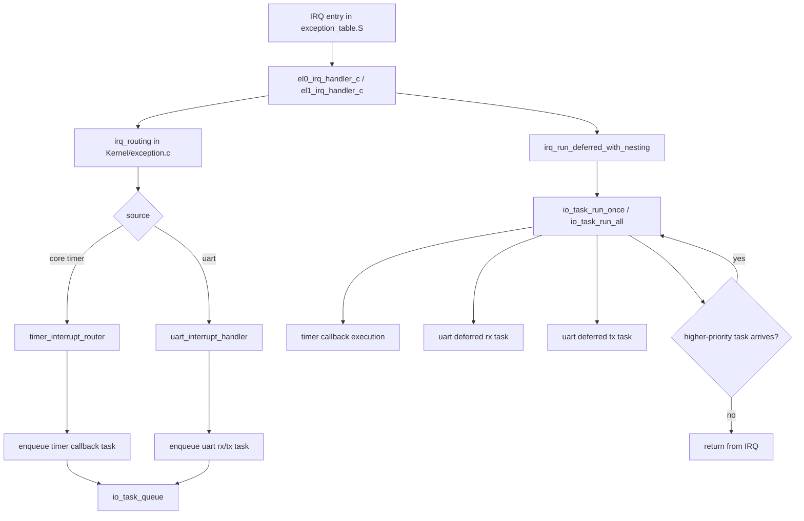

# Lab3 Advanced Exercise 2 Function Skeleton Plan

## Scope

This document lists only function skeletons for Concurrent I/O Devices Handling.
No implementation details are included.

Goals:
- Decouple interrupt handlers from heavy processing
- Support nested interrupts safely
- Add task preemption by priority

## File Plan

### 1) New file: Kernel/io_task_queue.h

Purpose:
- Define task queue data structures and public APIs

Suggested skeletons:
- typedef enum IoTaskType
- typedef enum IoTaskPriority
- typedef struct IoTask
- void io_task_queue_init(void)
- bool io_task_enqueue(IoTaskType type, IoTaskPriority priority, CommandFunc callback, int argc, char** argv)
- bool io_task_enqueue_timer(CommandFunc callback, int argc, char** argv, unsigned long long deadline_tick)
- bool io_task_enqueue_uart_rx(void)
- bool io_task_enqueue_uart_tx(void)
- bool io_task_dequeue(IoTask* out_task)
- bool io_task_has_pending(void)
- bool io_task_has_higher_priority_than(IoTaskPriority current)
- void io_task_run_once(void)
- void io_task_run_all(void)

### 2) New file: Kernel/io_task_queue.c

Purpose:
- Implement queue internals and scheduling policy

Suggested internal skeletons:
- static bool io_task_pool_alloc(IoTask** out_task)
- static void io_task_pool_free(IoTask* task)
- static void io_task_insert_by_priority(IoTask* task)
- static void io_task_dispatch(const IoTask* task)
- static void io_task_dispatch_timer(const IoTask* task)
- static void io_task_dispatch_uart_rx(const IoTask* task)
- static void io_task_dispatch_uart_tx(const IoTask* task)

### 3) Modify: Kernel/exception_table.S

Purpose:
- Make nested interrupts safe by preserving full return state

Entry/exit skeleton changes:
- SAVE_ALL macro keeps GPR save
- Add macro SAVE_ELR_SPSR
- Add macro RESTORE_ELR_SPSR
- el0_irq_entry uses SAVE_ALL + SAVE_ELR_SPSR before C handler
- el1_irq_entry uses SAVE_ALL + SAVE_ELR_SPSR before C handler
- Restore sequence: RESTORE_ELR_SPSR then RESTORE_ALL then eret

### 4) Modify: Kernel/exception.h

Purpose:
- Expose deferred IRQ execution hooks if needed

Suggested skeletons:
- void irq_enqueue_timer_event(void)
- void irq_enqueue_uart_event(void)
- void irq_process_deferred_tasks(void)

### 5) Modify: Kernel/exception.c

Purpose:
- Keep IRQ path minimal and enqueue deferred tasks

Suggested skeletons:
- static void irq_routing(unsigned long elr, unsigned long spsr, unsigned long* ctx)
- static void irq_handle_timer_source(void)
- static void irq_handle_uart_source(void)
- static void irq_enqueue_from_sources(unsigned int irq_src)
- static void irq_run_deferred_with_nesting(void)
- void el0_irq_handler_c(unsigned long elr, unsigned long spsr, unsigned long* ctx)
- void el1_irq_handler_c(unsigned long elr, unsigned long spsr, unsigned long* ctx)

Behavior target:
- IRQ handler enqueues tasks and returns quickly
- Deferred tasks are executed with interrupts enabled

### 6) Modify: Kernel/timer_manager.c

Purpose:
- Split timer expiration detection from callback execution

Suggested skeletons:
- bool timer_collect_expired_events(unsigned long long current_tick)
- bool timer_enqueue_expired_callbacks(unsigned long long current_tick)
- void timer_reprogram_next_deadline(void)
- void timer_interrupt_router(void)

Behavior target:
- timer_interrupt_router only collects expired timers, enqueues callbacks, re-arms compare
- callback execution happens in task queue path

### 7) Modify: Kernel/time_manager.h

Purpose:
- Public interface for deferred timer flow

Suggested skeletons:
- bool add_timer(CommandFunc callback, int argc, char** argv, double after_seconds)
- bool timer_enqueue_due_callbacks(unsigned long long current_tick)
- void timer_interrupt_router(void)

### 8) Modify: Driver/uart.h

Purpose:
- Expose split IRQ fast path and deferred work path

Suggested skeletons:
- void uart_interrupt_handler(void)
- bool uart_irq_fastpath_drain_rx(void)
- bool uart_irq_fastpath_drain_tx(void)
- void uart_deferred_rx_task(void)
- void uart_deferred_tx_task(void)

### 9) Modify: Driver/uart.c

Purpose:
- Keep IRQ routine short; push heavy work to queue

Suggested skeletons:
- bool uart_irq_fastpath_drain_rx(void)
- bool uart_irq_fastpath_drain_tx(void)
- void uart_deferred_rx_task(void)
- void uart_deferred_tx_task(void)
- void uart_interrupt_handler(void)

### 10) Modify: Kernel/kernel_main.c

Purpose:
- Initialize queue before enabling interrupts

Suggested skeletons:
- call io_task_queue_init() before daif_unmask_all()

## Suggested Priority Model

- High: timer callback dispatch tasks
- Medium: UART RX processing
- Low: UART TX follow-up work

## Call Graph (High-Level)

## Existing Files to Touch Summary

- Kernel/exception_table.S
- Kernel/exception.h
- Kernel/exception.c
- Kernel/time_manager.h
- Kernel/timer_manager.c
- Driver/uart.h
- Driver/uart.c
- Kernel/kernel_main.c

## New Files Summary

- Kernel/io_task_queue.h
- Kernel/io_task_queue.c

## Notes

- Keep current timer ordering logic and critical sections intact.
- Keep current shell command behavior intact.
- Do not move business logic into IRQ context; run it via deferred tasks.
- Ensure ELR_EL1 and SPSR_EL1 are preserved for nested IRQ correctness.

第一組：先建立通用 task queue（新增模組，建議放 Kernel）

新增一組 queue header/source（建議命名 io_task_queue）
內容要有：
Task 結構：task type、priority、callback、arg/context、next 或 ring index
Enqueue API：可在 IRQ 內快速塞任務
Dequeue API：按優先權取下一個任務
Run API：執行 pending tasks
Preemption helper：判斷是否有更高優先 task 已到達
臨界區保護（短區段）：避免 queue 被 IRQ/主流程同時改壞
第二組：中斷分派層

exception.c
你要改成：
irq_routing 只做來源判斷與最小搬運，不做重工作
timer 來源改成 enqueue timer-task
uart 來源改成 enqueue uart-task（或 enqueue rx/tx 後續工作）
在 return 前執行 task queue（而且在可被更高優先 IRQ 打斷的狀態下）
修掉目前多個 early return 造成 mask 狀態不對稱風險（要有統一 exit path）
不只最外層 return 前，nested return 的每一層都要做 priority 檢查，必要時先跑更高優先 task。
第三組：exception entry context（nested 必做）

exception_table.S
你要補：
在 entry 時把 ELR_EL1 / SPSR_EL1 納入保存框架
restore 時對應還原
保證 nested IRQ 下上一層 context 不被覆寫
C handler 看到的 context 佈局要固定、可擴充
第四組：timer 後續工作解耦

timer_manager.c
你要改成：
IRQ 內先找出過期 timer，先 enqueue 對應 task
callback 的實際執行轉到 task queue 執行階段
硬體 compare re-arm 保持在 IRQ 最小必要流程
原本排序與 compare 更新邏輯保留
IRQ 路徑只做到期收集 + enqueue + re-arm，絕不直接執行 callback。
第五組：UART 後續工作解耦

uart.c
你要改成：
IRQ handler 只做最小必要資料搬運（現在已有基礎）
把較重處理（例如字串處理/回顯策略/高層通知）轉 task queue
建立可重入與 budget 控制，避免單一裝置長時間佔 IRQ
IRQ fast path 只做最小搬運與必要硬體交握；較重處理與大量迴圈放 deferred task，並用 budget 防止單裝置壟斷 CPU。
這樣更符合 decouple 的設計邊界。
第六組：對外介面與初始化

exception.h
kernel_main.c
你要補：
task queue 對外 API 宣告
kernel_main 初始化流程加入 task queue init（在開 IRQ 前）
保持目前 boot 與 shell 進入順序不破壞
第七組：time manager 介面（若要讓 timer decouple 更乾淨）

time_manager.h
你要考慮補：
將 timer 到期事件轉 task 的介面
callback 執行與 timer 到期判定分離的 API
AE2 對應驗收條件（你可以照這三條驗）

Decouple 成功
IRQ 進來時不再直接跑重 callback，只 enqueue，處理工作在 queue 執行。
Nested 成功
在 task 執行中觸發更高優先 IRQ，不會破壞原本 context，且能正確返回。
Preemption 成功
低優先 task 執行時，若高優先來源到來，CPU 可透過 nested IRQ 在指令邊界打斷；在回返路徑經優先權判斷後，高優先 task 先執行，且原 context 可正確恢復。
