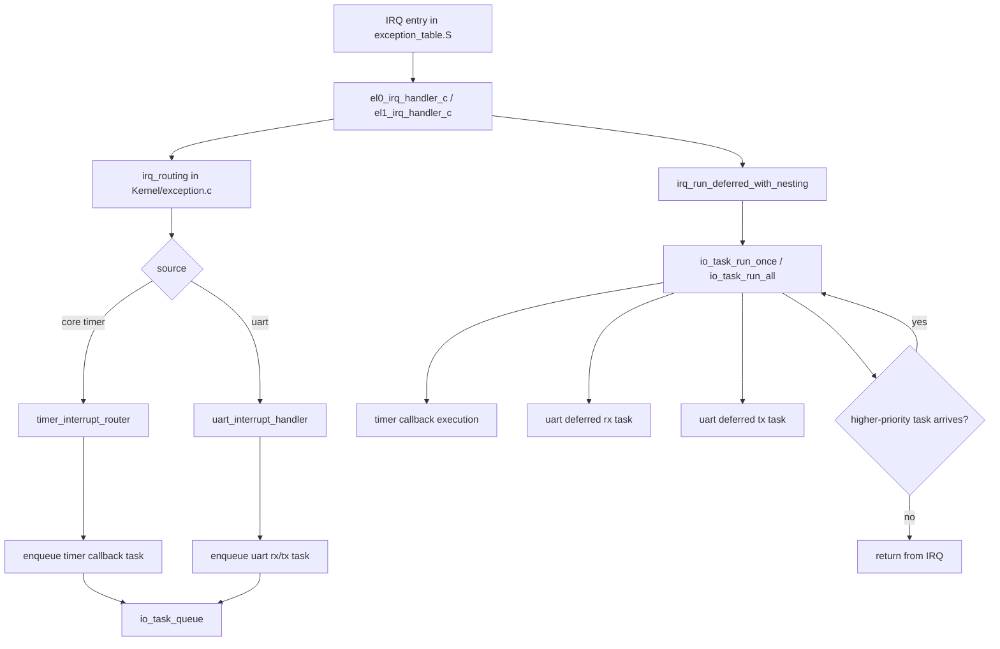

# Lab3 Advanced Exercise 2 Function Skeleton Plan

## Scope

This document lists only function skeletons for Concurrent I/O Devices Handling.
No implementation details are included.

Goals:
- Decouple interrupt handlers from heavy processing
- Support nested interrupts safely
- Add task preemption by priority

## File Plan

### 1) New file: Kernel/io_task_queue.h

Purpose:
- Define task queue data structures and public APIs

Suggested skeletons:
- typedef enum IoTaskType
- typedef enum IoTaskPriority
- typedef struct IoTask
- void io_task_queue_init(void)
- bool io_task_enqueue(IoTaskType type, IoTaskPriority priority, CommandFunc callback, int argc, char** argv)
- bool io_task_enqueue_timer(CommandFunc callback, int argc, char** argv, unsigned long long deadline_tick)
- bool io_task_enqueue_uart_rx(void)
- bool io_task_enqueue_uart_tx(void)
- bool io_task_dequeue(IoTask* out_task)
- bool io_task_has_pending(void)
- bool io_task_has_higher_priority_than(IoTaskPriority current)
- void io_task_run_once(void)
- void io_task_run_all(void)

### 2) New file: Kernel/io_task_queue.c

Purpose:
- Implement queue internals and scheduling policy

Suggested internal skeletons:
- static bool io_task_pool_alloc(IoTask** out_task)
- static void io_task_pool_free(IoTask* task)
- static void io_task_insert_by_priority(IoTask* task)
- static void io_task_dispatch(const IoTask* task)
- static void io_task_dispatch_timer(const IoTask* task)
- static void io_task_dispatch_uart_rx(const IoTask* task)
- static void io_task_dispatch_uart_tx(const IoTask* task)

### 3) Modify: Kernel/exception_table.S

Purpose:
- Make nested interrupts safe by preserving full return state

Entry/exit skeleton changes:
- SAVE_ALL macro keeps GPR save
- Add macro SAVE_ELR_SPSR
- Add macro RESTORE_ELR_SPSR
- el0_irq_entry uses SAVE_ALL + SAVE_ELR_SPSR before C handler
- el1_irq_entry uses SAVE_ALL + SAVE_ELR_SPSR before C handler
- Restore sequence: RESTORE_ELR_SPSR then RESTORE_ALL then eret

### 4) Modify: Kernel/exception.h

Purpose:
- Expose deferred IRQ execution hooks if needed

Suggested skeletons:
- void irq_enqueue_timer_event(void)
- void irq_enqueue_uart_event(void)
- void irq_process_deferred_tasks(void)

### 5) Modify: Kernel/exception.c

Purpose:
- Keep IRQ path minimal and enqueue deferred tasks

Suggested skeletons:
- static void irq_routing(unsigned long elr, unsigned long spsr, unsigned long* ctx)
- static void irq_handle_timer_source(void)
- static void irq_handle_uart_source(void)
- static void irq_enqueue_from_sources(unsigned int irq_src)
- static void irq_run_deferred_with_nesting(void)
- void el0_irq_handler_c(unsigned long elr, unsigned long spsr, unsigned long* ctx)
- void el1_irq_handler_c(unsigned long elr, unsigned long spsr, unsigned long* ctx)

Behavior target:
- IRQ handler enqueues tasks and returns quickly
- Deferred tasks are executed with interrupts enabled

### 6) Modify: Kernel/timer_manager.c

Purpose:
- Split timer expiration detection from callback execution

Suggested skeletons:
- bool timer_collect_expired_events(unsigned long long current_tick)
- bool timer_enqueue_expired_callbacks(unsigned long long current_tick)
- void timer_reprogram_next_deadline(void)
- void timer_interrupt_router(void)

Behavior target:
- timer_interrupt_router only collects expired timers, enqueues callbacks, re-arms compare
- callback execution happens in task queue path

### 7) Modify: Kernel/time_manager.h

Purpose:
- Public interface for deferred timer flow

Suggested skeletons:
- bool add_timer(CommandFunc callback, int argc, char** argv, double after_seconds)
- bool timer_enqueue_due_callbacks(unsigned long long current_tick)
- void timer_interrupt_router(void)

### 8) Modify: Driver/uart.h

Purpose:
- Expose split IRQ fast path and deferred work path

Suggested skeletons:
- void uart_interrupt_handler(void)
- bool uart_irq_fastpath_drain_rx(void)
- bool uart_irq_fastpath_drain_tx(void)
- void uart_deferred_rx_task(void)
- void uart_deferred_tx_task(void)

### 9) Modify: Driver/uart.c

Purpose:
- Keep IRQ routine short; push heavy work to queue

Suggested skeletons:
- bool uart_irq_fastpath_drain_rx(void)
- bool uart_irq_fastpath_drain_tx(void)
- void uart_deferred_rx_task(void)
- void uart_deferred_tx_task(void)
- void uart_interrupt_handler(void)

### 10) Modify: Kernel/kernel_main.c

Purpose:
- Initialize queue before enabling interrupts

Suggested skeletons:
- call io_task_queue_init() before unmask_all_exceptions()

## Suggested Priority Model

- High: timer callback dispatch tasks
- Medium: UART RX processing
- Low: UART TX follow-up work

## Call Graph (High-Level)

## Existing Files to Touch Summary

- Kernel/exception_table.S
- Kernel/exception.h
- Kernel/exception.c
- Kernel/time_manager.h
- Kernel/timer_manager.c
- Driver/uart.h
- Driver/uart.c
- Kernel/kernel_main.c

## New Files Summary

- Kernel/io_task_queue.h
- Kernel/io_task_queue.c

## Notes

- Keep current timer ordering logic and critical sections intact.
- Keep current shell command behavior intact.
- Do not move business logic into IRQ context; run it via deferred tasks.
- Ensure ELR_EL1 and SPSR_EL1 are preserved for nested IRQ correctness.
